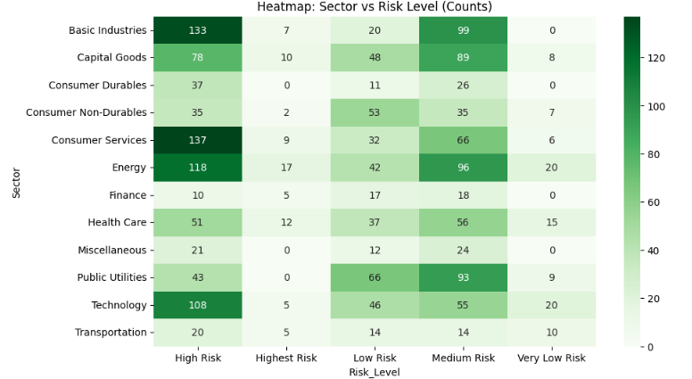
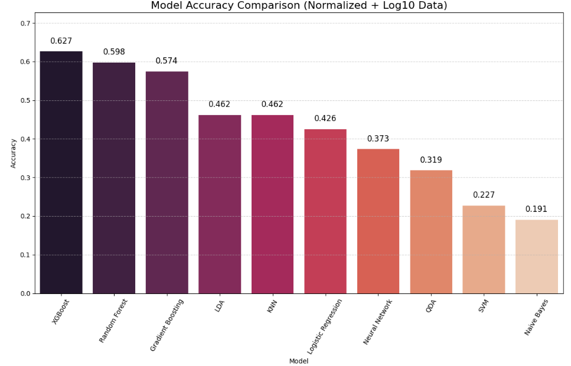
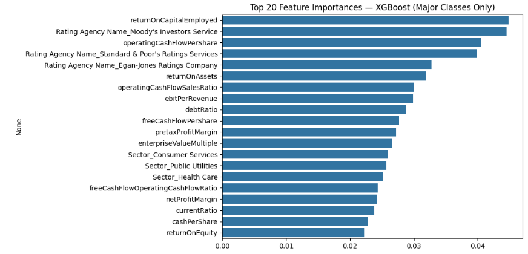
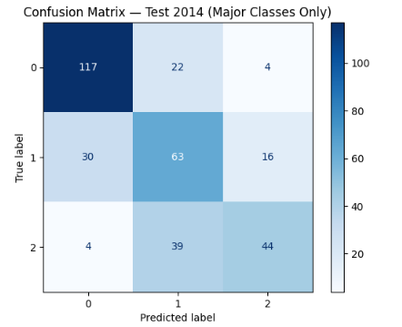

# Corporate Credit Risk Classification

This project develops an **end-to-end corporate credit risk classification framework** using firm-level financial ratios and machine learning models. The goal is to translate granular credit ratings into **interpretable risk levels** and evaluate how effectively different models can predict credit risk under realistic data challenges such as **class imbalance, skewed distributions, and sector heterogeneity**.

The emphasis is on **financial interpretability, modeling robustness, and practical risk insight**, rather than black-box prediction.

---

## Project Overview

Credit ratings are inherently ordinal, imbalanced, and noisy. Directly modeling raw ratings often leads to unstable predictions and poor generalization.

This project addresses these issues by:
- Regrouping raw credit ratings into **economically meaningful risk levels**
- Performing structured **exploratory data analysis**
- Applying robust preprocessing to financial ratios
- Training and comparing multiple classification models
- Interpreting results using confusion matrices, feature importance, and financial diagnostics

---

## Credit Rating Structure

### Original Credit Rating Distribution

The original rating distribution is highly imbalanced, with extreme ratings appearing infrequently. This motivates regrouping into broader risk categories.

---

### Regrouped Risk Level Distribution

Credit ratings are consolidated into ordered risk levels, improving class balance and aligning better with economic intuition.

---

## Exploratory Data Analysis

Key exploratory steps include:
- Distribution and skewness analysis of financial ratios
- Outlier diagnostics
- Sector-level comparisons
- Cross-tabulation between sectors and risk levels

### Sector vs Risk Level

Distinct sector-level risk patterns emerge, supporting the inclusion of sector information as a predictive feature.

---

## Data Preprocessing

### Numerical Variables
- Min–Max normalization
- Log transformation to reduce skewness
- Outlier treatment using the **1.5×IQR rule**

### Categorical Variables
- One-hot encoding for:
  - Rating agency
  - Industry sector

### Dataset Split
A **time-based split** is used to avoid look-ahead bias:
- Training set
- Test set
- Validation set (most recent observations)

---

## Modeling Approach

The following classification models are evaluated:

- Logistic Regression  
- K-Nearest Neighbors  
- Naive Bayes  
- Linear / Quadratic Discriminant Analysis  
- Neural Network  
- Random Forest  
- XGBoost  

### Model Performance Comparison

Tree-based models consistently outperform linear and distance-based approaches in both accuracy and stability.

---

## Final Model Interpretation

### Feature Importance

The most influential predictors include:
- Profitability measures
- Leverage ratios
- Liquidity indicators
- Cash flow stability metrics

These drivers align well with established credit risk theory.

---

## Model Evaluation

### Confusion Matrix

Key observations:
- Strong classification performance for low and medium risk firms
- Most misclassifications occur between **adjacent risk levels**
- Extreme high-risk firms remain challenging due to limited sample size

---

## Financial Interpretation Example

### Return on Capital Employed by Risk Level

Lower-risk firms exhibit higher and more stable returns, while higher-risk firms show greater dispersion and weaker profitability.

---

## Key Findings

- Proper rating regrouping significantly improves model performance
- Class imbalance is the main limitation for extreme risk prediction
- Random Forest provides the most stable overall results
- XGBoost shows strong potential with additional tuning and data
- Model outputs are financially interpretable and economically consistent

---

## Limitations and Future Work

- Limited observations in extreme risk categories
- No macroeconomic stress variables included
- Probability calibration not implemented

Potential extensions include:
- Macroeconomic scenario analysis
- Probability-of-default calibration
- Cost-sensitive learning
- Rating transition modeling

---

## Disclaimer

This project is for **research and demonstration purposes only**.

- Results depend on historical data and modeling assumptions
- Outputs do **not** constitute investment, lending, or credit advice
- Models are not intended for real-world decision-making without further validation

---

## Author

**Ke Zhang**  
Credit Risk Modeling · Financial Analytics · Machine Learning
